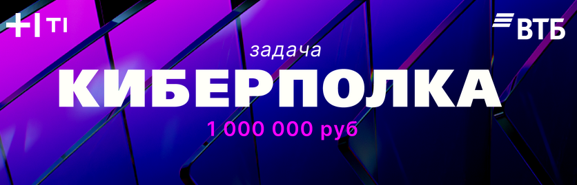

# Data Fusion 2026 — Киберполка

**Публичное решение задачи Киберполка Задача №2 Data Fusion Contest 2026**  
Multi‑label классификация финансовых продуктов банковских клиентов.

Данное решение выбивает на public: 0.8364

Автор:
Роман Тамразов

## DataFusion 2026
- **Ссылка на задачу:** [Data Fusion Contest 2026](https://ods.ai/competitions/data-fusion2026-cybershelf)
